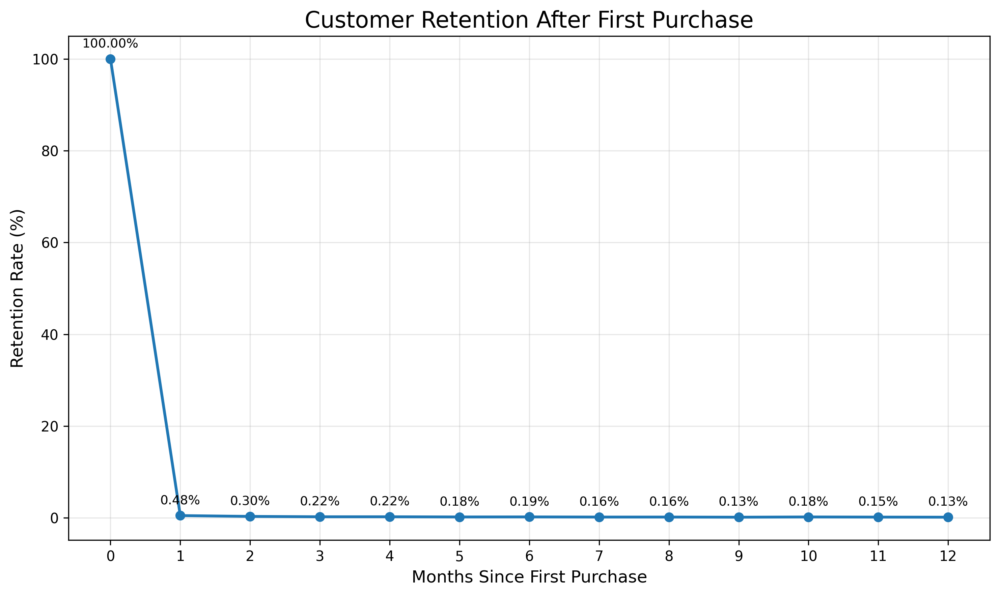
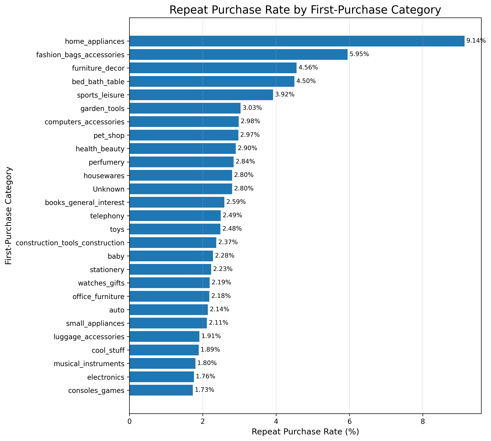
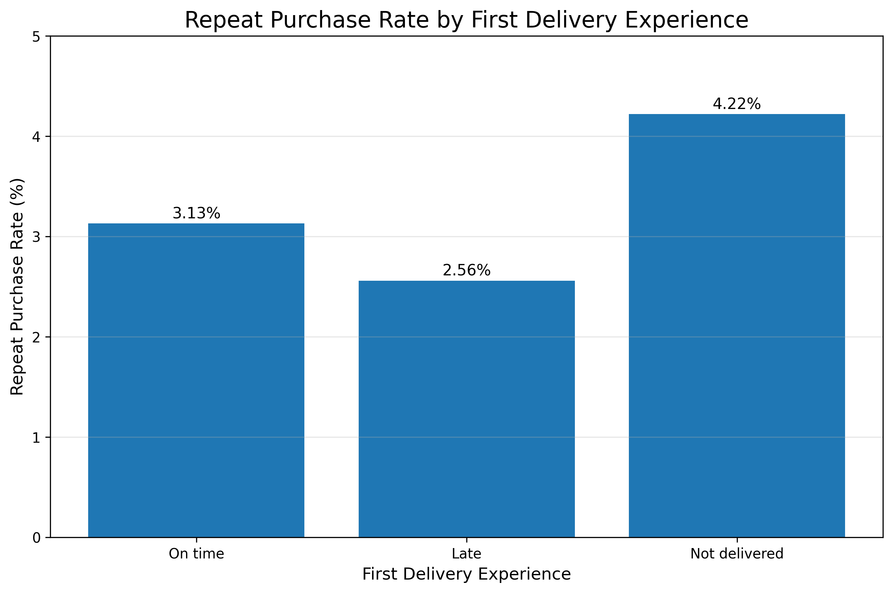
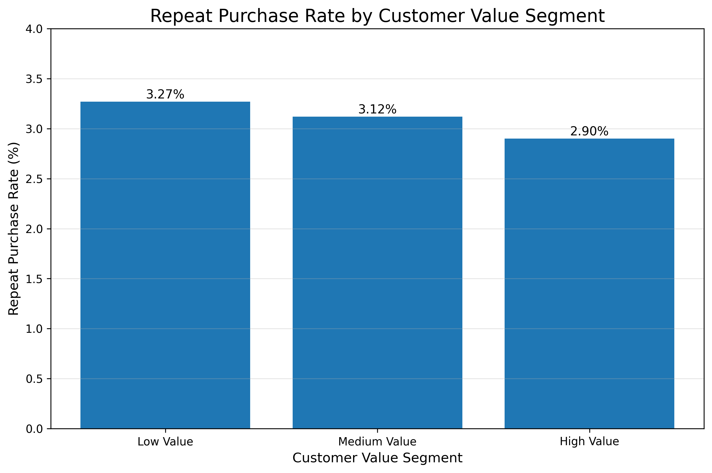

# Olist Customer Retention & Repeat Purchase Analysis

## Product Analytics Case Study

### Objective

Understand why customers do not return after their first purchase and identify product opportunities to increase repeat purchases.

This project combines **SQL analysis, customer retention analysis, data visualization, and Product Management recommendations** using the Olist Brazilian e-commerce dataset.

---

## 1. Business Problem

Olist acquires a large number of first-time customers, but only a small proportion return to make another purchase.

The key product question is:

> **How can an e-commerce platform increase repeat purchases after a customer's first order?**

The analysis focuses on identifying behavioral and experience-related patterns associated with repeat purchasing.

---

## 2. Dataset

The analysis uses the Olist Brazilian E-Commerce dataset containing data related to:

- Customers
- Orders
- Order items
- Payments
- Reviews
- Products
- Sellers
- Product categories
- Geolocation

### Dataset Size

| Metric | Value |
|---|---:|
| Unique customers | 96,096 |
| Total orders | 99,441 |
| Repeat customers | 2,997 |
| Repeat purchase rate | 3.12% |
| Average time to second purchase | 80.35 days |

---

## 3. Analytical Approach

The analysis was performed using PostgreSQL and Python.

### SQL Analysis

SQL was used to investigate:

- Overall repeat purchase behavior
- Customer retention by month
- Time to second purchase
- First-purchase category behavior
- Category-to-category transitions
- Delivery experience
- Customer value segments
- Repeat vs. non-repeat customers

### Python Visualization

Python and Matplotlib were used to visualize the major retention patterns.

---

# 4. Key Findings

## Finding 1 — Extremely Weak Early Retention

Customer retention drops sharply after the first purchase.

| Month | Retention Rate |
|---:|---:|
| 0 | 100.00% |
| 1 | 0.48% |
| 2 | 0.30% |
| 3 | 0.22% |
| 6 | 0.19% |
| 12 | 0.13% |

The average time to a second purchase among repeat customers is approximately **80 days**.

### Product implication

The first few weeks after the initial purchase represent an important opportunity for retention interventions.

A structured post-purchase journey should begin shortly after the first order rather than waiting until customers become inactive.

---

## Finding 2 — First-Purchase Category Is Associated With Retention

Repeat purchase behavior varies significantly depending on the category purchased in the customer's first order.

Examples:

| First-Purchase Category | Repeat Purchase Rate |
|---|---:|
| Home appliances | 9.14% |
| Fashion bags & accessories | 5.95% |
| Furniture decor | 4.56% |
| Bed/bath/table | 4.50% |
| Sports/leisure | 3.92% |
| Electronics | 1.76% |
| Consoles/games | 1.73% |

### Product implication

A single generic retention strategy may not work equally well across categories.

Post-purchase recommendations and messaging can be personalized based on the customer's first-purchase category.

---

## Finding 3 — Delivery Experience Is Associated With Repeat Purchase

Customers whose first order was delivered late showed a lower repeat purchase rate than customers whose first order was delivered on time.

| First Delivery Experience | Repeat Purchase Rate |
|---|---:|
| On time | 3.13% |
| Late | 2.56% |
| Not delivered | 4.22% |

The difference between on-time and late delivery is **0.57 percentage points**.

### Product implication

Customers experiencing a late first delivery could receive a targeted delivery-recovery journey involving proactive communication and post-delivery engagement.

### Data-quality note

The "Not delivered" segment has a higher repeat rate than the on-time segment. This should **not** be interpreted as evidence that non-delivery improves retention.

This group contains unusual order states and requires further investigation before drawing a causal conclusion.

---

## Finding 4 — Higher First-Order Value Does Not Mean Higher Retention

Customer value was segmented using first-order value.

| Customer Segment | Avg. First-Order Value | Repeat Purchase Rate |
|---|---:|---:|
| Low Value | 49.68 | 3.27% |
| Medium Value | 108.71 | 3.12% |
| High Value | 330.94 | 2.90% |

Repeat purchase rate decreases from **3.27% for low-value customers to 2.90% for high-value customers**.

### Product implication

High initial spend should not automatically be treated as a signal of high retention potential.

High-value first-time customers may require a differentiated retention strategy rather than simply receiving more promotional communication.

---

# 5. Visualizations

## Customer Retention Curve



The retention curve demonstrates the sharp decline in repeat activity following the first purchase.

---

## Repeat Purchase Rate by First-Purchase Category




The category analysis highlights significant differences in repeat purchase behavior across first-purchase categories.

---

## Repeat Purchase Rate by First Delivery Experience




Late first deliveries are associated with a lower repeat purchase rate compared with on-time deliveries.

---

## Repeat Purchase Rate by Customer Value Segment




Higher first-order value does not correspond to higher repeat purchase behavior.

---

# 6. Product Recommendations

## Recommendation 1 — Build a First-30-Day Retention Journey

Create a structured post-purchase journey beginning shortly after the first order.

Potential touchpoints:

1. Order delivery confirmation
2. Product education or usage content
3. Personalized complementary-product recommendations
4. Reminder or incentive before the customer becomes inactive

### Goal

Increase the probability of a second purchase during the early customer lifecycle.

---

## Recommendation 2 — Personalize Recommendations by First-Purchase Category

Use the customer's first-purchase category to determine recommended products and follow-up messaging.

For example:

- Bed/bath/table → Furniture decor / Housewares
- Furniture decor → Housewares / Garden tools
- Sports/leisure → Watches/gifts / Health & beauty

The category-transition analysis suggests that customers frequently move between related categories.

---

## Recommendation 3 — Create a Delivery-Recovery Journey

Customers experiencing a late first delivery should enter a targeted recovery flow.

Potential actions:

- Proactive delay notification
- Clear revised delivery expectations
- Post-delivery recovery communication
- Small incentive toward the next purchase
- Personalized recommendations after successful delivery

### Goal

Reduce the potential retention impact of a poor first-order experience.

---

# 7. Experiment Plan

## Experiment 1 — Personalized Second-Purchase Recommendations

### Hypothesis

Customers receiving recommendations based on their first-purchase category will have a higher second-purchase rate than customers receiving generic recommendations.

### Control

Generic post-purchase communication.

### Treatment

Category-personalized product recommendations.

### Primary KPI

**30-day repeat purchase rate**

### Secondary KPIs

- Click-through rate
- Conversion rate
- Average second-order value
- Time to second purchase

---

## Experiment 2 — Delivery Recovery Intervention

### Hypothesis

A targeted recovery experience after a late first delivery will improve repeat purchasing.

### Control

Standard post-delivery communication.

### Treatment

Proactive recovery communication + targeted incentive/recommendations.

### Primary KPI

**30-day repeat purchase rate among customers with late first deliveries**

### Secondary KPIs

- Second-order conversion
- Time to second purchase
- Customer engagement
- Incentive redemption rate

---

# 8. Success Metrics

## Primary KPI

### Repeat Purchase Rate

```text
Customers with 2+ purchases
──────────────────────────── × 100
Total unique customers